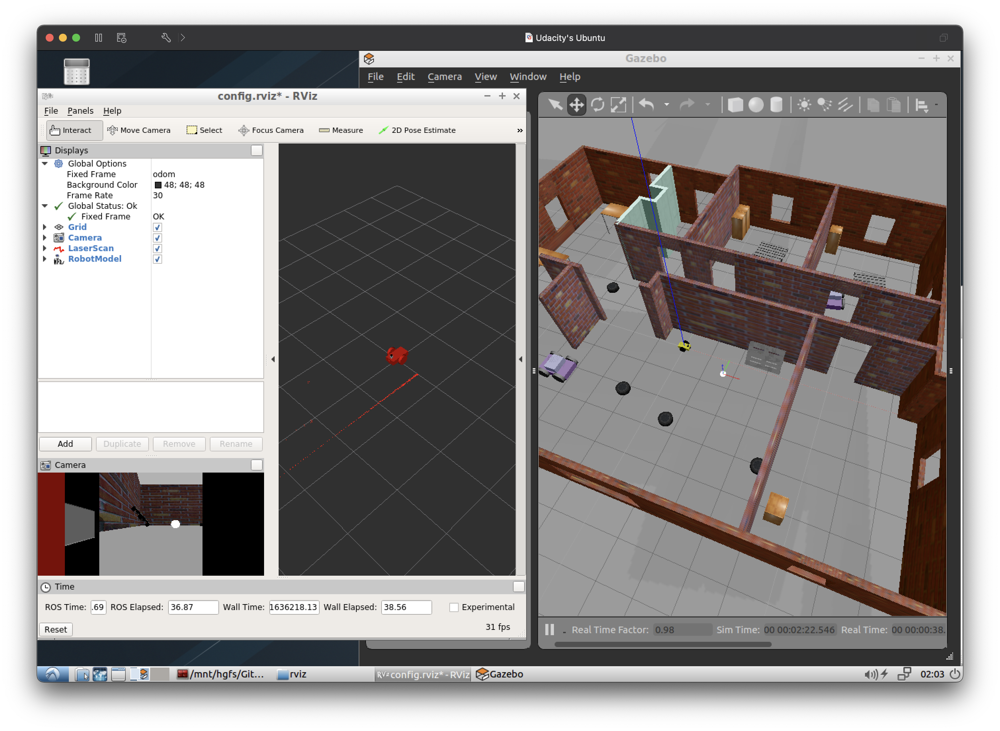

# Go_Chase_It
[](https://opensource.org/licenses/MIT) [](https://svgshare.com/i/Zhy.svg) [](https://atom.io)  [](https://www.codefactor.io/repository/github/michellemouse/go_chase_it)  

Second project of Udacity's [Robotics Software Engineer Nanodegree](https://www.udacity.com/course/robotics-software-engineer--nd209) program where I designed and built a mobile robot and house it on my world (from Gazebo_World repo).

The robot chases a white ball around as you move the ball inside the house!

<p align="center"></p>

## Environment
👉 Ubuntu 16.04 LTS  
👉 [ROS Kinetic Kame](http://wiki.ros.org/kinetic)  
👉 Gazebo 7.8.1  
👉 C++ 11  

## Compiling and Running
### Compiling
First, make sure you have sourced your ROS distro into the terminal environment
```
source /opt/ros/kinetic/setup.bash
```
Then, create a catkin workspace (skip this step if you already have one)
```
mkdir -p /home/workspace/catkin_ws/
cd /home/workspace/catkin_ws/
catkin_init_workspace
```
Clone this repository inside the `catkin_ws` folder
```
git clone https://github.com/MichelleMouse/Go_Chase_It.git .
```
Build the package and source the .bash setup into the environment
```
cd ..
catkin_make
source devel/setup.bash
```

### Running
Launch the simulation environment and RViz
```
roslaunch my_robot world.launch
```
Then, open a second terminal, source ROS and `setup.bash` and run the ball_chaser package
```
cd /home/workspace/catkin_ws/
source devel/setup.bash
roslaunch ball_chaser ball_chaser.launch
```
If you wish to see the feedback from the camera, run the following command in a third terminal window
```
cd /home/workspace/catkin_ws/
source devel/setup.bash
rosrun rqt_image_view rqt_image_view
```
